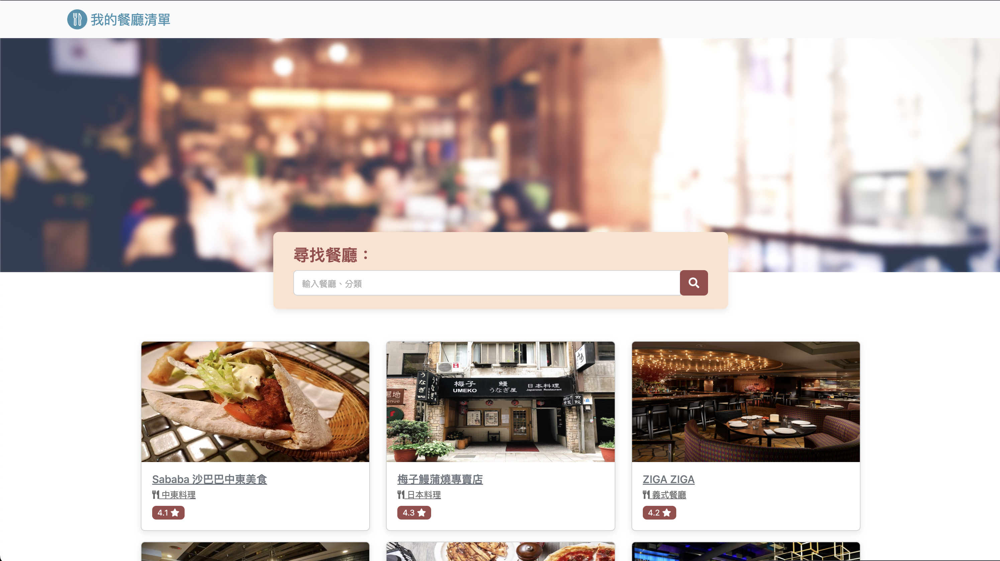

# 我的餐廳清單




## 介紹

紀錄自己收藏的餐廳清單，可以瀏覽餐廳圖片、查看電話及詳細資訊，還能連結到地圖。

### 功能

- 使用者在首頁可以見到所有餐廳資料
  - 照片
  - 名稱
  - 分類
  - 評分

- 使用者點入餐廳可見詳細資訊
  - 分類
  - 地址
  - 電話
  - 描述
  - 照片

- 使用者可以透過搜尋餐廳名稱來找到特定名稱餐廳
- 使用者可以透鍋搜尋餐廳類別來找到特定類別餐廳
- 使用者搜尋無結果時會顯示請重新查詢頁面提示

## 開始使用
1. 請先確認有安裝 node.js 與 npm
2. 開啟終端機(Terminal)進入到存放專案的本機位置，執行以下將專案 clone ： 
    ```bash
    https://github.com/James-Lee-01/restaurant_list.git
    ```
3. 進入存放此專案的資料夾
   ```bash
   cd restaurantList
   ```
4. 開啟之後，透過終端機輸入：

   ```bash
   npm install
   ```

5. 安裝完畢後，繼續輸入：

   ```bash
   npm run start
   ```

6. 若看見此行訊息則代表正常運行，打開瀏覽器進入到以下網址即可使用

   ```bash
   Listening on http://localhost:3000
   ```

7. 若欲暫停使用請執行以下：

   ```bash
   ctrl + c
   ```

## 開發工具

- Node.js 18.16.0
- Express 4.16.4
- Express-Handlebars 3.0.0
- Bootstrap 5.2.1
- Font-awesome 5.8.1